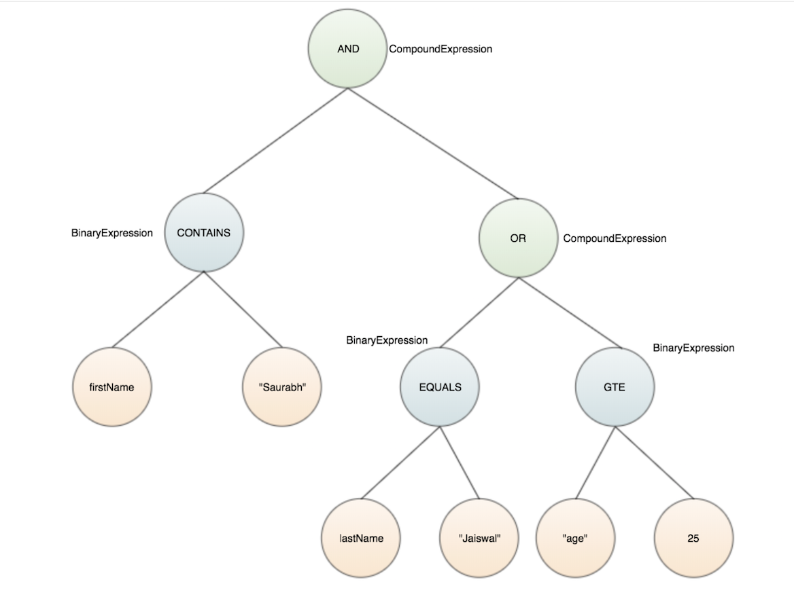

[](https://app.circleci.com/pipelines/github/intuit/graphql-filter-java) 
[](http://www.apache.org/licenses/LICENSE-2.0)

## Overview
This library helps GraphQL developers build awesome APIs with fine grain filtering support.

## Requirements
* grahql-java (v13.x)
* Java 8.x & Above

## Features
This library will help create filter conditions which are dynamically created by combining any supported filter criteria field along with any of the supported logical operations including AND, OR and NOT.  Consider the examples below.
### Queries

#### OR
```
{
  searchEmployees (filter : {
      or : [{ firstName : {contains : "Saurabh"}},{ lastName : {equals : "Jaiswal"}}]
    }) {
      firstName
      lastName
      age
    }
}
```
#### AND
```
{
  searchEmployees (filter : {
      and : [{ firtName : {contains : "Saurabh"}},{ age : {gte : 25}}]
    }) {
      firstName
      lastName
      age
    }
}
```
#### AND with OR
```
{
  searchEmployees (filter : {
      and : [
        { firstName : {contains : "Saurabh"}},
        { or : [{ lastName: {equals : "Jaiswal"}},{ age: {gte: 25}}
        ]}]
    }) {
      firstName
      lastName
      age
    }
}
```
## Usage
### Dependency
```xml
<dependency>
    <groupId>com.intuit.graphql</groupId>
    <artifactId>graphql-filter-java</artifactId>
    <version>1.0.0</version>
</dependency>
```
### Schema
```
# Define the query type
type Query {
   searchEmployees(filter: Filter): [Employee!]
 }
 
# Define the types
type Employee {
   firstName: String!
   lastName: String!
   age: Int!
 }
  
# Define filter input
input Filter {
   firstName: StringExpression
   lastName: StringExpression
   age: IntExpression
    
   and: [Filter!]
   or: [Filter!]
   not: Filter
}
 
# Define String expression
input StringExpression {
   equals: String
   contains: String
}
 
# Define Int Expression
input IntExpression {
   eq: Int
   gt: Int
   gte: Int
   lt: Int
   lte: Int
}
```

### JPA Specification
Generates filter expression using JPA Specification for any SQL database. 
```java
@Repository
public interface EmployeeRepository extends JpaRepository<EmployeeEntity, String>, JpaSpecificationExecutor<EmployeeEntity> {
}
```
```java
@Getter
@Setter
@Entity
@Table(name = "employee")
public class EmployeeEntity {
    private String firstName;
    private String lastName;
    private Integer age;
}
```
```java
@Component
@Transactional
public class EmployeeService {
    @Autowired
    private EmployeeRepository employeeRepository;

    /**
     * Searched employees based on filter criteria.
     */ 
    public  List<EmployeeEntity> searchEmployees(DataFetchingEnvironment env) {
        List<EmployeeEntity> employees = null;
        Specification<EmployeeEntity> specification = getSpecification(env);
        if (specification != null) {
           employees = employeeRepository.findAll(specification);
        } else {
            employees = employeeRepository.findAll();
        }
        return employees;
    }
    
    /**
     * Generates the filter JPA specification
     */
    private Specification<EmployeeEntity> getSpecification(DataFetchingEnvironment env) {
        FilterExpression.FilterExpressionBuilder builder = FilterExpression.newFilterExpressionBuilder();
        FilterExpression filterExpression = builder.field(env.getField())
                .args(env.getArguments())
                .build();
        Specification<EmployeeEntity> specification = filterExpression.getExpression(ExpressionFormat.JPA);
        return specification;
    }
}
```
### SQL WHERE
Generates SQL WHERE clause which can then be directly applied to any SQL database.

```java
private String getExpression(DataFetchingEnvironment env) {
    FilterExpression.FilterExpressionBuilder builder = FilterExpression.newFilterExpressionBuilder();
    FilterExpression filterExpression = builder.field(env.getField())
        .args(env.getArguments())
        .build();
    String expression = filterExpression.getExpression(ExpressionFormat.SQL);
    return expression;   
}
```

#### Expression output
```
WHERE ((lastName = 'Jaiswal') OR (firstName LIKE '%Saurabh%'))
```
## How it works?
When graphql-java receives and parses the source filter expression, it creates an AST in memory which contains all the fields, operators and values supplied in the source filter. The problem is
the generated AST does not know about the valid rules of a correct logical expression with multiple filter criteria. In order to get a meaningful expression out of the source
filter input, filter library parses the GraphQL generated AST and generates a new expression AST with correct syntax and semantics.
After this step, the generated AST looks as shown below in memory.
<p>

</p>

```
(firstName contains Saurabh) and ((lastName equals Jaiswal) or (age gte 25))
```   
## Supported Formats
- Infix String
- SQL WHERE clause
- JPA Specification

## Supported Operators
### Relational
   * **String** (EQUALS, CONTAINS, STARTS, ENDS)
   * **Numeric** (EQ, LT, GT, LTE, GTE)
   * **Range** (IN, BETWEEN)
### Logical
   * **AND**
   * **OR** 
   * **NOT**

## Supported Database
- MySQL
## Complete GraphQL JPA Example
[GraphQL Java Filtering With JPA Specification](/example/)
